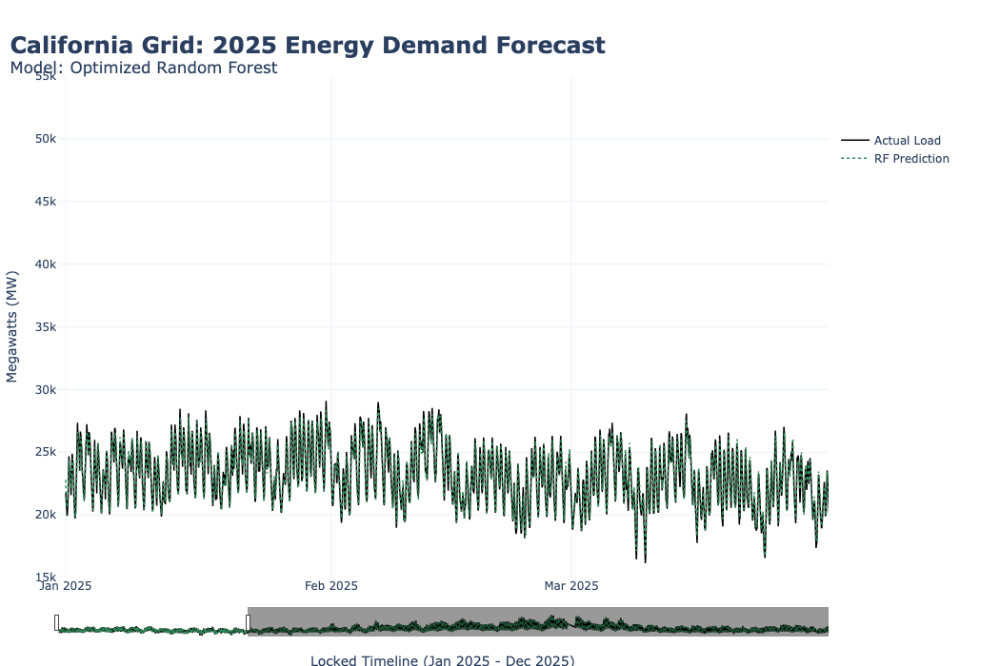

# Spatiotemporal Modeling of Electricity Demand in California
Author: Shannon Storts

---

## Executive Summary

This project forecasts California ISO (CAISO) electricity demand by integrating hourly grid load data with regional NOAA weather observations.

Using a full 12-month dataset for 2025, demand is modeled as a spatiotemporal problem. Weather data from Sacramento, Los Angeles, and San Diego is combined with engineered features to capture how regional temperature variation impacts statewide electricity demand.

## Model Output

Final 2025 electricity demand forecast using the optimized Random Forest model:

### Final Model Performance
- Optimized Random Forest Regressor
- **R²:** 0.9293
- **RMSE:** 720.91 MW

---

## Project Scope

Electricity demand in California is strongly influenced by regional micro-climates.

Analysis incorporating NOAA Marine Heatwave data shows that inland and coastal regions contribute differently to peak demand. The timing of these regional peaks introduces measurable variation in overall grid load.

---

## Data Sources

- CAISO hourly electricity demand data (2025)
- NOAA weather data
  - Sacramento (USW00093225)
  - Los Angeles (USW00023174)
  - San Diego (USW00023122)
- NOAA California Current Marine Heatwave Tracker

---

## Feature Schema

### Target
- **MW:** Hourly CAISO grid load (Megawatts)

### Lag Features
- **MW_lag_1h**
- **MW_lag_24h**

### Temporal Features
- **hour, dayofweek, month**

### Engineered Features
- **sac_heat, lax_heat, sd_heat**

### Raw Weather Features
- **temp_sac, temp_lax, temp_sd**

### Clustering Features
- K-Means inputs (hour, avg_temp, avg_humidity)

---

## Modeling Approach

### Baseline (Raw Features)
- Linear Regression → R²: -0.2145
- Random Forest → R²: 0.6493

### Engineered Models
- Linear Regression → R²: 0.8527, RMSE: 1040.56 MW
- Neural Network → R²: 0.9088, RMSE: 818.62 MW
- Optimized Random Forest → R²: 0.9293, RMSE: 720.91 MW

---

## Key Findings

- Raw weather variables alone do not sufficiently explain demand
- Feature engineering significantly improves model performance
- Regional temperature variation is a primary driver of electricity demand
- Lag features improve the model’s ability to capture demand cycles

---

## Conclusion

Combining time-based features with regional weather data allows electricity demand to be modeled with high accuracy.

---

## Tech Stack

- Python (pandas, numpy)
- scikit-learn
- TensorFlow / Keras
- SciKeras
- matplotlib
- seaborn
- plotly